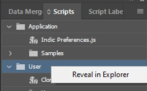

# indesign-scripts
Collection of ID scripts for scanlations

## Installation

* Open InDesign.
* Open the scripts panel window.

* Right click on the User folder item.
* Select Reveal in Explorer.
* Copy the lib folder into as a subfolder under the folder opened in Explorer.
* Copy scripts you wish to run directly into the folder opened in Explorer. 
  * For example, you can copy all files from this repository into there.
* Scripts in that folder will appear in the scripts panel window.

## Scripts

### Style Scripts

#### [CloneStyleFromSelectedItemForAllGraphicsInLayer.jsx](./CloneStyleFromSelectedItemForAllGraphicsInLayer.jsx)

Clones the style from the currently selected item to all graphic items in the currently selected layer.

### Sizing Scripts

#### [SizePageToFirstGraphicOnPageInLayer](./SizePageToFirstGraphicOnPageInLayer.jsx)

Sizes the current page to the first graphic on the current page normalized to 72 dpi in the currently selected layer.

#### [SizeAllPagesToFirstGraphicOnPageInLayer](./SizeAllPagesToFirstGraphicOnPageInLayer.jsx)

Sizes all pages in the project to the first graphic on their respective pages normalized to 72 dpi in the currently selected layer.

#### [ScaleAllCharacterStyles](./ScaleAllCharacterStyles.jsx)

Scales all paragraph styles by a specified 0-500%. (100% is no change.) Point size, leading, indent, space before and after are scaled.

### Importing Scripts

#### [PlaceBackgroundOnEachPage](./PlaceBackgroundOnEachPage.jsx)

Prompts for a selection of multiple files and places all those files in name order in the currently selected layer one per page creating additional pages if needed along the way.

# Export Scripts

#### [ExportFileToPdfInteractiveAndConvertPagesToPsd.jsx](ExportFileToPdfInteractiveAndConvertPagesToPsd.jsx)

(Not working) Export project to an Interactive Pdf then invoke Photoshop to convert the Psd to one Psd per page.
